<!-- ===================================================================
     Eunseok Lee · Full-Stack Director
     Profile README — Terminal Professional theme
     =================================================================== -->

[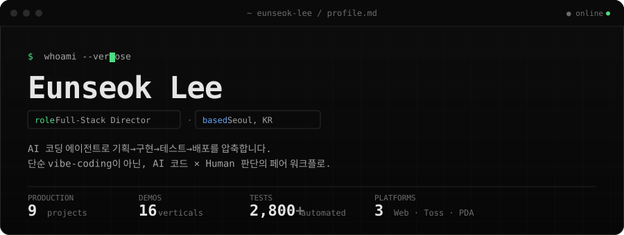](https://github.com/doublesilver)

> **풀스택 외주 디렉터.** AI 코딩 에이전트로 기획 → 구현 → 테스트 → 배포 사이클을 압축합니다.
> 현재 **[Agora](https://agora-production-17a6.up.railway.app)** (멀티 AI 토론 도구)를 운영하며, **9개 프로덕션 · 16개 업종 데모**를 보유하고 있습니다.
> 풀스택 / AI 엔지니어 외주 · 정규직 모두 열려 있습니다 — **[korea5410@gmail.com](mailto:korea5410@gmail.com)**

 

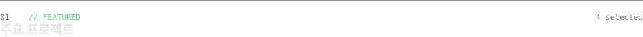

<table>
<tr>
<td width="50%" valign="top">

[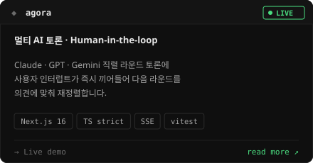](https://github.com/doublesilver/agora)

</td>
<td width="50%" valign="top">

[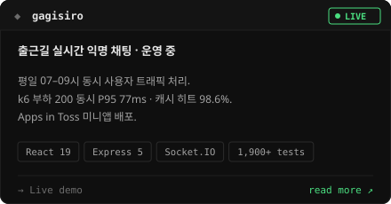](https://github.com/doublesilver/subway-board)

</td>
</tr>
<tr>
<td width="50%" valign="top">

[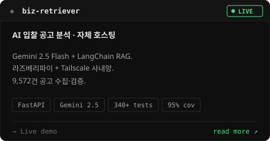](https://github.com/doublesilver/biz-retriever)

</td>
<td width="50%" valign="top">

[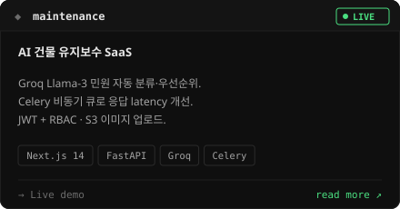](https://github.com/doublesilver/maintenance-app)

</td>
</tr>
</table>

 

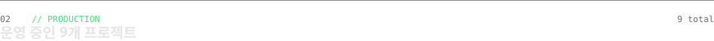

<!-- =================== PROJECT 1 =================== -->
### `01.` [Agora](https://github.com/doublesilver/agora) — 멀티 AI 토론, Human-in-the-loop

> Claude · GPT · Gemini 직렬 라운드 토론 + 사용자 인터럽트가 즉시 라운드만 끊고 다음 라운드를 의견에 맞춰 재정렬. 단순 다중 호출과 다른, **인간이 토론에 참여하는 패턴.**

| 영역 | 내용 |
|:---|:---|
| **패턴** | 2개 `AbortController` 분리 — `roundAbort` vs `sessionAbort` · Node 20+ `AbortSignal.any` 합성 |
| **AI** | `@anthropic-ai/sdk` · `openai` · `@google/genai` · Anthropic prompt caching (2-block 분할) |
| **보안** | BYOK (sessionStorage only · 서버 디스크 미저장) · JSONL append-only logger · 시크릿 자동 검증 |
| **품질** | TypeScript strict 0 errors · **vitest 26 tests** · 9-시나리오 회귀 |
| **스택** | Next.js 16 (App Router) · Tailwind v4 · SSE token streaming · Docker standalone · Railway |

🔗 **[Live](https://agora-production-17a6.up.railway.app)** · [README](https://github.com/doublesilver/agora) · [ARCHITECTURE](https://github.com/doublesilver/agora/blob/main/ARCHITECTURE.md)

<!-- =================== PROJECT 2 =================== -->
### `02.` [Gagisiro · 가기싫어](https://github.com/doublesilver/subway-board) — 출근길 실시간 익명 채팅

> **운영 중 — [gagisiro.com](https://gagisiro.com)** · 평일 07:00–09:00 동시 사용자 트래픽 처리.

| 영역 | 내용 |
|:---|:---|
| **기능** | 9개 호선별 실시간 채팅 · 답장/리액션 · 실시간 혼잡도 · 게시글 검색 · 푸시 알림 |
| **AI 필터** | Local Regex + OpenAI Moderation API 하이브리드 |
| **운영** | Recharts 어드민 대시보드 · DAU/WAU/MAU · 신고 관리 · 커스텀 SQL |
| **스택** | React 19 · Vite · Express 5 · Socket.IO 4.8 · PostgreSQL · Redis 5.10 |
| **배포** | Apps in Toss 미니앱 · 인앱 광고 3종 · Railway + Vercel · GitHub Actions × 4 |
| **품질** | **1,900+ tests** (139 파일) · 80%+ coverage · OWASP Top 10 대응 |

<b>⚡ k6 부하 테스트 (CI 자동 실행)</b>

| 시나리오 | 동시 사용자 | 처리량 | P95 |
|:---|:---:|:---:|:---:|
| Smoke | 1 | 0.73 req/s | 73ms |
| Load | 50 | 9.87 req/s | 28ms |
| Stress | **200** | **235 req/s** | **77ms** |
| Spike | **200** | **363 req/s** | **81ms** |

> 출처: `backend/tests/load/load-test.js` · Redis 캐시 히트율 **98.64%**

<!-- =================== PROJECT 3 =================== -->
### `03.` [Biz-Retriever](https://github.com/doublesilver/biz-retriever) — AI 입찰 공고 분석

> **Gemini 2.5 Flash + LangChain RAG** · 라즈베리파이 자체 호스팅 · Tailscale 사내망.

| 영역 | 내용 |
|:---|:---|
| **AI** | `google-generativeai 0.4.0` · `gemini-2.5-flash` · LangChain RAG · 프롬프트 엔지니어링 |
| **스택** | FastAPI 0.115 (Async) · SQLAlchemy 2.0 · taskiq-redis · psycopg2 · aiosqlite |
| **DevOps** | Raspberry Pi + Tailscale · Prometheus + Grafana · HTTPS/SSL · Docker Compose |
| **품질** | **340+ tests** (97 파일) · **95% coverage** · 9,572건 공고 수집 검증 |

🔗 **[Live](https://biz-retriever.vercel.app)**

<!-- =================== PROJECT 4 =================== -->
### `04.` [Maintenance App](https://github.com/doublesilver/maintenance-app) — AI 건물 유지보수 SaaS

> **Groq Llama-3 분류** + Celery 비동기 큐 · 민원 자동 분류·우선순위 산정.

| 영역 | 내용 |
|:---|:---|
| **AI** | `groq 1.0.0` (Llama-3) + `openai 1.59.7` 보강 |
| **아키** | Celery 5.4 비동기 큐로 응답 latency 개선 · Redis 5.2 메시지 브로커 |
| **스택** | Next.js 14 · Tailwind · FastAPI 0.115 · S3 이미지 업로드 |
| **보안** | JWT 인증 · RBAC · Rate Limiting |
| **인프라** | Railway (Backend) + Vercel (Frontend) |

🔗 **[Live](https://maintenance-app-azure.vercel.app)**

<!-- =================== PROJECT 5 =================== -->
### `05.` [인터넷공룡](https://github.com/doublesilver/internet-dinor) — 인터넷/TV 가입 비교

> 통신사 요금제 비교 + 상담 신청 · 미들웨어 기반 관리자.

| 영역 | 내용 |
|:---|:---|
| **스택** | Next.js 15 · React 19 · `@supabase/supabase-js` · Tailwind · Zod |
| **기능** | 요금제 비교 · 가격 계산기 · 상담 신청 폼 · 미들웨어 관리자 |
| **품질** | **128 tests** (24 파일) |

🔗 **[Live](https://internetdinor.vercel.app)**

<!-- =================== PROJECT 6 =================== -->
### `06.` [Scan](https://github.com/doublesilver/scan) — 물류창고 바코드 스캐너

> **Kotlin Android (Zebra TC60 PDA)** + FastAPI + 웹 도면 에디터.

| 영역 | 내용 |
|:---|:---|
| **Mobile** | Kotlin Android · Zebra TC60 EAN-13 스캔 · MVVM + Retrofit2 |
| **Web** | 창고 도면 에디터 (셀·텍스트·테두리·영역 관리) |
| **Backend** | FastAPI + aiosqlite · NAS WebDAV 연동 · 도면 API 책임 분리 |
| **인프라** | Zebra 전용 Mini PC 사내 서버 · 스캔→조회 **0.3–0.5s** |
| **품질** | **55+ tests** · 프로덕션 하드웨어 무중단 운영 |

<!-- =================== PROJECT 7 =================== -->
### `07.` [OddParty](https://github.com/doublesilver/oddparty-site) — 소셜 파티 신청 플랫폼

> **프레임워크 제로** — Vanilla HTML/CSS/JS + Python stdlib `http.server`.

| 영역 | 내용 |
|:---|:---|
| **스택** | Vanilla HTML/CSS/JS · Python stdlib · SQLite/PostgreSQL |
| **보안** | JWT 인증 · WYSIWYG 관리자 대시보드 |
| **품질** | **300+ tests** · 자체 100% coverage |
| **인프라** | Vercel + Railway |

🔗 **[Live](https://oddparty.vercel.app)**

<!-- =================== PROJECT 8 =================== -->
### `08.` [Knowledge Copilot](https://github.com/doublesilver/knowledge-copilot) — AI 문서 RAG 플랫폼

> **OpenAI Embedding + RAG 파이프라인** · Next.js 14 + FastAPI.

| 영역 | 내용 |
|:---|:---|
| **AI** | OpenAI Embedding · RAG 검색·요약 |
| **스택** | Next.js 14 · FastAPI · Python 3.12 · SQLite |
| **인프라** | Vercel + Railway · GitHub Actions |
| **품질** | 38 tests (TS 14 + Python 24) |

<!-- =================== PROJECT 9 =================== -->
### `09.` [S Partners Landing](https://github.com/doublesilver/s-partners-landing) — 소상공인 정책자금 랜딩

> 모바일 우선 반응형 · FormSubmit 이메일 연동.

| 영역 | 내용 |
|:---|:---|
| **스택** | HTML5 · CSS3 · Vanilla JS |
| **UX** | 모바일 우선 · 신뢰감 중심 |
| **인프라** | Vercel · FormSubmit |

🔗 **[Live](https://s-partners.vercel.app)**

 

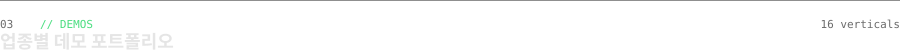

> 외주 상담 시 클라이언트에게 즉시 보여주는 업종별 맞춤 데모입니다.

| 카테고리 | 데모 |
|:---|:---|
| **예약 / 매장** | [booking](https://doublesilver.github.io/demo-booking/) · [cafe](https://doublesilver.github.io/demo-cafe/) · [clinic](https://doublesilver.github.io/demo-clinic/) · [studio](https://doublesilver.github.io/demo-studio/) · [queue](https://doublesilver.github.io/demo-queue/) |
| **커머스 / 유통** | [catalog](https://doublesilver.github.io/demo-catalog/) · [inventory](https://doublesilver.github.io/demo-inventory/) · [order](https://doublesilver.github.io/demo-order/) |
| **업무 자동화** | [crm-lite](https://doublesilver.github.io/demo-crm-lite/) · [hr](https://doublesilver.github.io/demo-hr/) · [report-gen](https://doublesilver.github.io/demo-report-gen/) · [receipt](https://doublesilver.github.io/demo-receipt/) |
| **AI / 데이터** | [chatbot](https://doublesilver.github.io/demo-chatbot/) · [review-ai](https://doublesilver.github.io/demo-review-ai/) · [news-digest](https://doublesilver.github.io/demo-news-digest/) |
| **전문직** | [lawfirm](https://doublesilver.github.io/demo-lawfirm/) |

 

**Languages**
&nbsp;`TypeScript`&nbsp; · &nbsp;`Python`&nbsp; · &nbsp;`Kotlin`&nbsp; · &nbsp;`JavaScript`&nbsp; · &nbsp;`SQL`

**Frontend**
&nbsp;`Next.js 14/15/16`&nbsp; · &nbsp;`React 19`&nbsp; · &nbsp;`Vite`&nbsp; · &nbsp;`Tailwind`&nbsp; · &nbsp;`Socket.IO`

**Backend**
&nbsp;`FastAPI`&nbsp; · &nbsp;`Express 5`&nbsp; · &nbsp;`Celery`&nbsp; · &nbsp;`SQLAlchemy`&nbsp; · &nbsp;`taskiq`

**Data & Infra**
&nbsp;`PostgreSQL`&nbsp; · &nbsp;`Redis`&nbsp; · &nbsp;`SQLite`&nbsp; · &nbsp;`Supabase`&nbsp; · &nbsp;`Docker`&nbsp; · &nbsp;`Nginx`&nbsp; · &nbsp;`Tailscale`

**Cloud**
&nbsp;`Railway`&nbsp; · &nbsp;`Vercel`&nbsp; · &nbsp;`Raspberry Pi`&nbsp; (self-hosted)

**Observability**
&nbsp;`Prometheus`&nbsp; · &nbsp;`Grafana`&nbsp; · &nbsp;`GitHub Actions`&nbsp; · &nbsp;`k6`

**AI / LLM**
&nbsp;`Anthropic Claude`&nbsp; · &nbsp;`OpenAI GPT`&nbsp; · &nbsp;`Google Gemini`&nbsp; · &nbsp;`Groq Llama-3`&nbsp; · &nbsp;`LangChain`

**Daily Agents**
&nbsp;`Claude Code`&nbsp; · &nbsp;`OpenAI Codex`&nbsp; · &nbsp;`Gemini CLI`

 

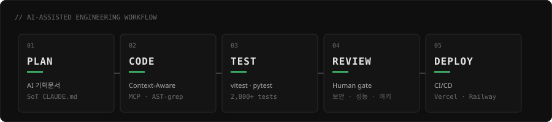

> 매 단계마다 **사용자(=Director)** 가 의사결정에 참여 → 단순 vibe-coding이 아닌 **AI 코드 × Human 판단의 페어 워크플로**입니다.

 

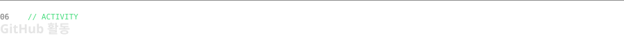

  

<picture>
  <source media="(prefers-color-scheme: dark)" srcset="https://raw.githubusercontent.com/doublesilver/doublesilver/output/github-contribution-grid-snake-dark.svg" />
  <source media="(prefers-color-scheme: light)" srcset="https://raw.githubusercontent.com/doublesilver/doublesilver/output/github-contribution-grid-snake.svg" />
  
</picture>

 

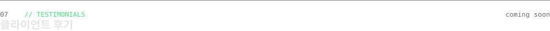

> 클라이언트 후기는 정리 중입니다. 추천이나 레퍼런스가 필요하시면 회신드릴게요.

<table>
<tr>
<td width="33%" valign="top" align="center">

`★★★★★`

후기를 기다리고 있습니다

— Coming soon

</td>
<td width="33%" valign="top" align="center">

`★★★★★`

후기를 기다리고 있습니다

— Coming soon

</td>
<td width="33%" valign="top" align="center">

`★★★★★`

후기를 기다리고 있습니다

— Coming soon

</td>
</tr>
</table>

 

<b>Q. 어떤 형태의 외주가 가능한가요?</b>

단발(MVP), 정기 계약(주 N시간), 마일스톤(고정가) 모두 가능합니다. 첫 30분 무료 상담 후 가장 적합한 형태를 함께 정합니다.

<b>Q. AI 코딩 에이전트로만 작업하나요?</b>

기획·아키텍처·보안·성능 리뷰는 모두 사람(저)의 판단입니다. AI는 구현 속도와 테스트 커버리지를 끌어올리는 도구로 씁니다. 모든 결과물은 사람의 코드 리뷰를 거쳐 머지됩니다.

<b>Q. 작업 결과물의 소유권은 어떻게 되나요?</b>

별도 합의가 없는 한 결과물의 모든 권리는 클라이언트에 귀속됩니다. 저는 일반화된 기술 노하우만 가져갑니다.

<b>Q. 유지보수와 인수인계는 어떻게 진행되나요?</b>

`CLAUDE.md` · `ARCHITECTURE.md` · `AGENTS.md` 등 자체 문서 표준을 두어 다른 개발자가 인수받기 쉽게 작성합니다. 인수인계 세션도 별도 제공합니다.

<b>Q. NDA / 보안 요구사항이 까다로워도 되나요?</b>

가능합니다. Biz-Retriever는 사내망(Tailscale)에서만 동작하는 자체 호스팅 구조로 운영 중입니다. 비슷한 수준의 보안 요건도 대응 가능합니다.

 

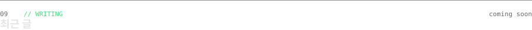

> 기술 글과 회고를 정리하고 있습니다.

- `[준비 중]` AI 코딩 에이전트로 9개 프로덕트를 운영하면서 배운 것
- `[준비 중]` Multi-AI 토론 시스템에서 인터럽트를 안전하게 처리하는 법
- `[준비 중]` 라즈베리파이 + Tailscale로 실무 SaaS 자체 호스팅하기

 

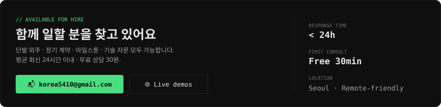

| 가능한 역할 | 작업 형태 | 결제 방식 |
|:---|:---|:---|
| **Full-Stack 외주** (Web · Mobile · AI) | 단발 / 정기 / 마일스톤 | 시급 · 프로젝트 단위 |
| **AI Engineer** (RAG · 멀티 에이전트 · 프롬프트) | 단발 / 컨설팅 | 시간제 · 회당 |
| **Backend** (FastAPI · Express · Postgres) | 외주 / 기술 자문 | 협의 |

**📬 [korea5410@gmail.com](mailto:korea5410@gmail.com)** &nbsp;·&nbsp; 평균 회신 24h &nbsp;·&nbsp; Seoul / Remote-friendly

 

---

<code>Last Updated: 2026-05-12 · Built with detail-driven verification · ⌘ doublesilver</code>

