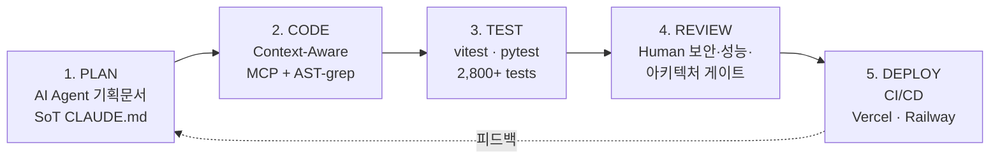

 

---

## ⚡ TL;DR

> **풀스택 외주 디렉터.** AI 코딩 에이전트로 기획→구현→테스트→배포 사이클을 압축합니다. **9개 프로덕션** · **16개 업종 데모** · **Web · Toss 미니앱 · Android PDA** 3개 플랫폼.
>
> Currently shipping **[Agora](https://github.com/doublesilver/agora)** — multi-AI debate tool with human-in-the-loop intervention. Open to full-stack / AI engineer 외주.

---

## 🌟 Featured

---

## 🛠️ Tech Stack

 

 

> **AI Agents** in daily workflow: Claude Code · OpenAI Codex · Gemini CLI · LangChain · Anthropic prompt caching

---

## 🚀 Production Projects (9)

### 1. [Agora](https://github.com/doublesilver/agora) · Multi-AI Debate Tool with Human-in-the-Loop

> **Claude · GPT · Gemini 직렬 라운드 토론** + 사용자 인터럽트가 즉시 라운드만 끊고 다음 라운드를 의견에 맞춰 재정렬. 단순 다중 호출과 달리 **인간이 토론에 참여**하는 패턴.

- 🎭 **Pattern**: 2개 AbortController 분리 (`roundAbort` vs `sessionAbort`) — 인터럽트는 라운드만 끊고 세션은 살림 / Node 20+ `AbortSignal.any` 합성
- 🤖 **AI**: `@anthropic-ai/sdk` + `openai` + `@google/genai` · Anthropic prompt caching (`cache_control` 2-block 분할)
- 🔐 **Security**: BYOK (sessionStorage only · 서버 디스크 미저장) · JSONL append-only logger · 시크릿 자동 검증 (`scrub-check.sh`)
- ✅ **Quality**: TypeScript strict 0 errors · **vitest 26 tests** · 9-scenario regression (interrupt · timeout · budget · time)
- 🏗️ **Tech**: Next.js 16 (App Router) + Tailwind v4 · SSE token streaming · Docker standalone
- 🔧 **Infra**: Railway (containerized) · BYOK 단일 사용자 데모 가정

**Live**: [agora-production-17a6.up.railway.app](https://agora-production-17a6.up.railway.app)
**Docs**: [README](https://github.com/doublesilver/agora) · [ARCHITECTURE](https://github.com/doublesilver/agora/blob/main/ARCHITECTURE.md) · [AGENTS](https://github.com/doublesilver/agora/blob/main/AGENTS.md)

---

### 2. [Gagisiro (가기싫어)](https://github.com/doublesilver/subway-board) · 출근길 실시간 익명 채팅

> **운영 중 — [gagisiro.com](https://gagisiro.com)** · 평일 07:00~09:00 동시 사용자 트래픽 처리

- 🚇 **Features**: 9개 호선별 실시간 채팅 · 답장/리액션 · 실시간 혼잡도 · 게시글 검색 · 푸시 알림
- 🤖 **AI Filtering**: Local Regex + OpenAI Moderation API 하이브리드
- 📊 **Admin**: Recharts 대시보드 · DAU/WAU/MAU 분석 · 신고 관리 · 커스텀 SQL 쿼리
- 🏗️ **Tech**: React `19.2.3` + Vite · Express `5.0.0` · Socket.IO `4.8.3` · TypeScript strict · PostgreSQL · Redis `5.10.0`
- 📱 **Apps in Toss**: 토스 미니앱 배포 · 인앱 광고 3종 (배너/전면/보상형)
- 🔧 **Infra**: Railway (Backend + DB + Redis) · Vercel (Frontend) · GitHub Actions CI/CD (4 workflows)
- ✅ **Quality**: **1,900+ tests** (139 test files) · 80%+ coverage · OWASP Top 10 대응

<b>⚡ k6 부하 테스트 (CI 자동 실행)</b>

| 시나리오 | 동시 사용자 | 처리량 | P95 |
| --- | :---: | :---: | :---: |
| Smoke | 1 | 0.73 req/s | 73ms |
| Load | 50 | 9.87 req/s | 28ms |
| Stress | **200** | **235 req/s** | **77ms** |
| Spike | **200** | **363 req/s** | **81ms** |

> 출처: `backend/tests/load/load-test.js` + `.github/workflows/load-testing.yml` · Redis 캐시 히트율 98.64%

---

### 3. [Biz-Retriever](https://github.com/doublesilver/biz-retriever) · AI 입찰 공고 분석 플랫폼

> **Gemini 2.5 Flash + LangChain RAG** · Raspberry Pi 자체 호스팅 · Tailscale 사내 망

- 🤖 **AI**: `google-generativeai 0.4.0` · `gemini-2.5-flash` · LangChain RAG · Prompt Engineering
- 🏗️ **Tech**: FastAPI `0.115.0` (Async) · SQLAlchemy `2.0.25` · taskiq-redis · psycopg2 · aiosqlite
- 🔧 **DevOps**: Raspberry Pi + Tailscale · Prometheus + Grafana · HTTPS/SSL · Docker Compose
- ✅ **Quality**: **340+ tests** (97 test files) · **95% coverage** (badge) · 9,572건 공고 수집 검증

**Live**: [biz-retriever.vercel.app](https://biz-retriever.vercel.app)

---

### 4. [Maintenance App](https://github.com/doublesilver/maintenance-app) · AI 스마트 건물 유지보수 SaaS

> **Groq Llama-3 분류** + Celery 비동기 큐 · 풀스택 SaaS

- 🤖 **AI**: `groq 1.0.0` (Llama-3 분류) + `openai 1.59.7` (보강) · 민원 자동 분류 / 우선순위 산정
- ⚡ **Architecture**: Celery `5.4.0` 비동기 큐로 응답 latency 개선 · Redis `5.2.1` 메시지 브로커
- 🏗️ **Tech**: Next.js 14 + Tailwind (Frontend) · FastAPI `0.115.6` (Backend) · S3 이미지 업로드
- 🔐 **Security**: JWT 인증 · RBAC · Rate Limiting
- 🔧 **Infra**: Railway (Backend) + Vercel (Frontend)

**Live**: [maintenance-app-azure.vercel.app](https://maintenance-app-azure.vercel.app) · [API Docs](https://maintenance-app-production-9c47.up.railway.app/docs)

---

### 5. [인터넷공룡](https://github.com/doublesilver/internet-dinor) · 인터넷/TV 가입 비교 사이트

> **Next.js `^15.0.0` + React `^19.0.0` + Supabase** · 통신사 요금제 비교 + 상담 신청

- 🏗️ **Tech**: Next.js 15 · React 19 · `@supabase/supabase-js` (DB + Auth) · Tailwind CSS · Zod
- 📊 **Features**: 요금제 비교 · 가격 계산기 · 상담 신청 폼
- 👨‍💼 **Admin**: 미들웨어 기반 관리자 페이지 · 관리자 API
- ✅ **Quality**: **128 tests** (24 test files)

**Live**: [internetdinor.vercel.app](https://internetdinor.vercel.app)

---

### 6. [Scan](https://github.com/doublesilver/scan) · 물류창고 바코드 스캐너

> **Kotlin Android (Zebra TC60 PDA)** + FastAPI + 웹 도면 에디터

- 📱 **Mobile**: Kotlin Android 앱 · Zebra TC60 PDA EAN-13 스캔 · MVVM + Retrofit2
- 🗺️ **Web Editor**: 웹 기반 창고 도면 에디터 (셀 크기·텍스트·테두리·영역 관리)
- 🏗️ **Backend**: FastAPI + aiosqlite · NAS WebDAV 연동 · 도면 API 책임 분리
- 🔧 **Infra**: Zebra 전용 Mini PC 사내 서버 · 스캔→조회 0.3~0.5s
- ✅ **Quality**: **55+ tests** (Python 6 파일 + Kotlin) · 프로덕션 하드웨어 무중단 운영

---

### 7. [OddParty](https://github.com/doublesilver/oddparty-site) · 소셜 파티 신청 플랫폼

> **프레임워크 제로 풀스택** — Vanilla HTML/CSS/JS + Python stdlib http.server

- 🏗️ **Tech**: Vanilla HTML/CSS/JS (Frontend) · Python stdlib (Backend) · SQLite/PostgreSQL
- 🔐 **Security**: JWT 인증 · WYSIWYG 관리자 대시보드
- ✅ **Quality**: **300+ tests** · README 자체 100% coverage 주장
- 🔧 **Infra**: Vercel (Frontend) + Railway (Backend)

**Live**: [oddparty.vercel.app](https://oddparty.vercel.app)

---

### 8. [Knowledge Copilot](https://github.com/doublesilver/knowledge-copilot) · AI 문서 질의/요약 RAG 플랫폼

> **OpenAI Embedding + RAG 파이프라인** · Next.js 14 + FastAPI

- 🤖 **AI**: OpenAI Embedding · RAG 검색·요약 파이프라인
- 🏗️ **Tech**: Next.js 14 (Frontend) · FastAPI + Python 3.12 (Backend) · SQLite
- 🔧 **Infra**: Vercel + Railway · GitHub Actions CI/CD
- ✅ **Quality**: 38 tests (TS 14 + Python 24)

---

### 9. [S Partners Landing](https://github.com/doublesilver/s-partners-landing) · 소상공인 정책자금 상담 랜딩

> **모바일 우선 반응형** · FormSubmit 연동

- 🏗️ **Tech**: HTML5 · CSS3 · Vanilla JS
- 📱 **UX**: 모바일 우선 · 신뢰감 중심 UI
- 🔧 **Infra**: Vercel · FormSubmit 이메일 연동

**Live**: [s-partners.vercel.app](https://s-partners.vercel.app)

---

## 🎨 Demo Portfolio — 16개 업종별 데모

> 외주 상담 시 클라이언트에게 즉시 보여주는 업종별 맞춤 데모 모음입니다.

| 카테고리 | 데모 |
| --- | --- |
| **예약 / 매장** | [📅 booking](https://doublesilver.github.io/demo-booking/) · [☕ cafe](https://doublesilver.github.io/demo-cafe/) · [🏥 clinic](https://doublesilver.github.io/demo-clinic/) · [🎨 studio](https://doublesilver.github.io/demo-studio/) · [🍽️ queue](https://doublesilver.github.io/demo-queue/) |
| **커머스 / 유통** | [🛍️ catalog](https://doublesilver.github.io/demo-catalog/) · [📦 inventory](https://doublesilver.github.io/demo-inventory/) · [🚚 order](https://doublesilver.github.io/demo-order/) |
| **업무 자동화** | [📇 crm-lite](https://doublesilver.github.io/demo-crm-lite/) · [👥 hr](https://doublesilver.github.io/demo-hr/) · [📊 report-gen](https://doublesilver.github.io/demo-report-gen/) · [🧾 receipt](https://doublesilver.github.io/demo-receipt/) |
| **AI / 데이터** | [💬 chatbot](https://doublesilver.github.io/demo-chatbot/) · [⭐ review-ai](https://doublesilver.github.io/demo-review-ai/) · [📰 news-digest](https://doublesilver.github.io/demo-news-digest/) |
| **전문직** | [⚖️ lawfirm](https://doublesilver.github.io/demo-lawfirm/) |

---

## ⚙️ How I Build — AI-Assisted Engineering Workflow

> 매 단계마다 **사용자(=Director)** 가 의사결정에 참여 → 단순 vibe-coding이 아니라 **AI 코드 + Human 판단**의 페어 워크플로.

---

## 📊 GitHub Activity

 

  

---

## 🐍 Contribution Snake

<picture>
  <source media="(prefers-color-scheme: dark)" srcset="https://raw.githubusercontent.com/doublesilver/doublesilver/output/github-contribution-grid-snake-dark.svg" />
  <source media="(prefers-color-scheme: light)" srcset="https://raw.githubusercontent.com/doublesilver/doublesilver/output/github-contribution-grid-snake.svg" />
  
</picture>

---

## 💼 Hire Me

| 가능한 역할 | 작업 형태 | 결제 |
| --- | --- | --- |
| Full-Stack 외주 (Web · Mobile · AI) | 단발 / 정기 / 마일스톤 | 시급 / 프로젝트 단위 |
| AI Engineer (RAG · 멀티 에이전트 · 프롬프트 엔지니어링) | 단발 / 컨설팅 | 시간제 / 회당 |
| Backend (FastAPI · Express · Postgres) | 외주 / 기술 자문 | 협의 |

**📬 외주 / 포지션 문의**: [korea5410@gmail.com](mailto:korea5410@gmail.com)
**🌐 라이브 데모**: [Agora](https://agora-production-17a6.up.railway.app) · [Gagisiro](https://gagisiro.com) · [Biz-Retriever](https://biz-retriever.vercel.app)

<!-- Last Updated: 2026-05-09 · Built with detail-driven verification -->
