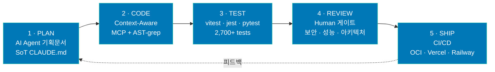

<!-- ============ HEADER BANNER ============ -->

<!-- ============ TYPING HERO ============ -->

 

<!-- ============ LIVE / CONTACT BADGES ============ -->

 

<!-- ============ TL;DR ============ -->
> [!NOTE]
> **풀스택 외주 디렉터.** AI 코딩 에이전트로 기획 → 구현 → 테스트 → 배포 사이클을 압축합니다.
> **9개 프로덕션** · **16개 업종 데모** · **Web · 인앱 웹뷰 · Android PDA** 3개 플랫폼.
> 단순 vibe-coding이 아니라 **AI 코드 + Human 판단**의 페어 워크플로로 딜리버리합니다.

## Featured Work

<table>
<tr>
<td width="50%" valign="top">

### [Agora](https://github.com/doublesilver/agora)
**Multi-AI 토론 · Human-in-the-Loop**

Claude · GPT · Gemini 직렬 라운드 + 사용자 인터럽트.
2개 AbortController 분리 설계 · Anthropic prompt caching.

`Next.js 16` · `TypeScript strict` · `SSE` · `vitest 26`

 

</td>
<td width="50%" valign="top">

### [Gagisiro](https://github.com/doublesilver/subway-board)
**출근길 실시간 익명 채팅 · 운영 중**

평일 08–10시 · 17–19시 운영 (KST) · k6 P95 77ms @ 200 동시.
인앱 웹뷰 연동 · OCI(arm-big) 자가호스팅.

`React 19` · `Express 5` · `Socket.IO` · `1,821 tests`

</td>
</tr>
<tr>
<td width="50%" valign="top">

### [Biz-Retriever](https://github.com/doublesilver/biz-retriever)
**AI 입찰 공고 분석 · Raspberry Pi 자체 호스팅**

Gemini 2.5 Flash + LangChain RAG · Tailscale 사내 망.
9,572건 공고 수집 검증 · 95% coverage.

`FastAPI` · `Gemini 2.5` · `340+ tests`

</td>
<td width="50%" valign="top">

### [Maintenance App](https://github.com/doublesilver/maintenance-app)
**AI 건물 유지보수 SaaS**

Groq Llama-3 분류 · Celery 비동기 큐 · S3 업로드 · JWT + RBAC.

`Next.js 14` · `FastAPI` · `Groq` · `Celery 5.4`

</td>
</tr>
</table>

## Tech Stack

**Languages & Frameworks**

**Database · Infra · Observability**

**AI / LLM**

**Cloud & Hosting**

> **AI Agents in daily workflow**: Claude Code · OpenAI Codex · Gemini CLI

## Production Projects (9)

> 프로젝트 카드를 펼쳐 상세를 확인하세요.

<b>🤖 1. Agora</b> — Multi-AI Debate with Human-in-the-Loop

 

> **Claude · GPT · Gemini 직렬 라운드 토론** + 사용자 인터럽트가 라운드만 끊고 다음 라운드를 의견에 맞춰 재정렬. 단순 다중 호출과 달리 **인간이 토론에 참여**하는 패턴.

- 🎭 **Pattern**: 2개 AbortController 분리 (`roundAbort` vs `sessionAbort`) · Node 20+ `AbortSignal.any` 합성
- 🤖 **AI**: `@anthropic-ai/sdk` + `openai` + `@google/genai` · prompt caching (`cache_control` 2-block)
- 🔐 **Security**: BYOK (sessionStorage only · 서버 미저장) · JSONL append-only logger · `scrub-check.sh`
- ✅ **Quality**: TypeScript strict 0 errors · **vitest 26 tests** · 9-scenario regression
- 🏗️ **Tech**: Next.js 16 (App Router) + Tailwind v4 · SSE token streaming · Docker standalone

**Live**: [agora-production-17a6.up.railway.app](https://agora-production-17a6.up.railway.app) · **Docs**: [ARCHITECTURE](https://github.com/doublesilver/agora/blob/main/ARCHITECTURE.md)

<b>🚇 2. Gagisiro (가기싫어)</b> — 출근길 실시간 익명 채팅 · 운영 중

 

> **[gagisiro.com](https://gagisiro.com)** · 평일 08–10시 · 17–19시 (KST) 동시 사용자 트래픽 처리

- 🚇 **Features**: 9개 호선별 실시간 채팅 · 답장/리액션 · 실시간 혼잡도 · 게시글 검색 · 푸시 알림
- 📱 **하이브리드 웹뷰**: 모바일 앱 인앱 웹뷰 임베드 · 인앱 뒤로가기 JS 브릿지(iOS/Android)
- 🤖 **AI Filtering**: Local Regex + OpenAI Moderation API 하이브리드
- 📊 **Admin**: Recharts 대시보드 · DAU/WAU/MAU 분석 · 신고 관리 · 커스텀 SQL 쿼리
- 🏗️ **Tech**: React `19.2.3` + Vite · Express `5.0.0` · Socket.IO `4.8.3` · TypeScript strict · PostgreSQL · Redis
- 🔧 **Infra**: OCI (arm-big) — Backend ×3 + PostgreSQL + Redis (docker compose) · Caddy 정적 서빙 + cookie LB · 엣지 CSP · GitHub Actions CI/CD
- ✅ **Quality**: **1,821 tests** (126 test files) · 80%+ coverage · OWASP Top 10 대응

| k6 시나리오 | 동시 사용자 | 처리량 | P95 |
| --- | :---: | :---: | :---: |
| Smoke | 1 | 0.73 req/s | 73ms |
| Load | 50 | 9.87 req/s | 28ms |
| Stress | **200** | **235 req/s** | **77ms** |
| Spike | **200** | **363 req/s** | **81ms** |

> Redis 캐시 히트율 98.64% · 출처 `backend/tests/load/` + `.github/workflows/load-testing.yml`

<b>🐕 3. Biz-Retriever</b> — AI 입찰 공고 분석 플랫폼

 

> **Gemini 2.5 Flash + LangChain RAG** · Raspberry Pi 자체 호스팅 · Tailscale 사내 망

- 🤖 **AI**: `google-generativeai 0.4.0` · `gemini-2.5-flash` · LangChain RAG · Prompt Engineering
- 🏗️ **Tech**: FastAPI `0.115.0` (Async) · SQLAlchemy `2.0.25` · taskiq-redis · psycopg2 · aiosqlite
- 🔧 **DevOps**: Raspberry Pi + Tailscale · Prometheus + Grafana · HTTPS/SSL · Docker Compose
- ✅ **Quality**: **340+ tests** (97 test files) · **95% coverage** · 9,572건 공고 수집 검증

**Live**: [biz-retriever.vercel.app](https://biz-retriever.vercel.app)

<b>🏢 4. Maintenance App</b> — AI 스마트 건물 유지보수 SaaS

 

> **Groq Llama-3 분류** + Celery 비동기 큐 · 풀스택 SaaS

- 🤖 **AI**: `groq 1.0.0` (Llama-3 분류) + `openai 1.59.7` · 민원 자동 분류 / 우선순위 산정
- ⚡ **Architecture**: Celery `5.4.0` 비동기 큐 · Redis `5.2.1` 메시지 브로커
- 🏗️ **Tech**: Next.js 14 + Tailwind · FastAPI `0.115.6` · S3 이미지 업로드
- 🔐 **Security**: JWT 인증 · RBAC · Rate Limiting

**Live**: [maintenance-app-azure.vercel.app](https://maintenance-app-azure.vercel.app) · [API Docs](https://maintenance-app-production-9c47.up.railway.app/docs)

<b>📡 5. 인터넷공룡</b> — 인터넷/TV 가입 비교 사이트

 

> **Next.js 15 + React 19 + Supabase** · 통신사 요금제 비교 + 상담 신청

- 🏗️ **Tech**: Next.js 15 · React 19 · `@supabase/supabase-js` (DB + Auth) · Tailwind · Zod
- 📊 **Features**: 요금제 비교 · 가격 계산기 · 상담 신청 폼 · 미들웨어 기반 관리자
- ✅ **Quality**: **128 tests** (24 test files)

**Live**: [internetdinor.vercel.app](https://internetdinor.vercel.app)

<b>📦 6. Scan</b> — 물류창고 바코드 스캐너 (Android PDA)

 

> **Kotlin Android (Zebra TC60 PDA)** + FastAPI + 웹 도면 에디터

- 📱 **Mobile**: Kotlin Android · Zebra TC60 PDA EAN-13 스캔 · MVVM + Retrofit2
- 🗺️ **Web Editor**: 웹 기반 창고 도면 에디터 (셀·텍스트·테두리·영역 관리)
- 🏗️ **Backend**: FastAPI + aiosqlite · NAS WebDAV 연동
- 🔧 **Infra**: Zebra 전용 Mini PC 사내 서버 · 스캔→조회 0.3~0.5s
- ✅ **Quality**: **55+ tests** · 프로덕션 하드웨어 무중단 운영

<b>🎉 7. OddParty</b> — 소셜 파티 신청 플랫폼 (프레임워크 제로)

 

> **Vanilla HTML/CSS/JS + Python stdlib http.server** — 의존성 최소 풀스택

- 🏗️ **Tech**: Vanilla HTML/CSS/JS · Python stdlib · SQLite/PostgreSQL
- 🔐 **Security**: JWT 인증 · WYSIWYG 관리자 대시보드
- ✅ **Quality**: **300+ tests**

**Live**: [oddparty.vercel.app](https://oddparty.vercel.app)

<b>📚 8. Knowledge Copilot</b> — AI 문서 질의/요약 RAG 플랫폼

 

> **OpenAI Embedding + RAG 파이프라인** · Next.js 14 + FastAPI

- 🤖 **AI**: OpenAI Embedding · RAG 검색·요약 파이프라인
- 🏗️ **Tech**: Next.js 14 · FastAPI + Python 3.12 · SQLite
- ✅ **Quality**: 38 tests (TS 14 + Python 24)

<b>🏦 9. S Partners Landing</b> — 소상공인 정책자금 상담 랜딩

 

> **모바일 우선 반응형** · FormSubmit 연동

- 🏗️ **Tech**: HTML5 · CSS3 · Vanilla JS · 신뢰감 중심 UI
- 🔧 **Infra**: Vercel · FormSubmit 이메일 연동

**Live**: [s-partners.vercel.app](https://s-partners.vercel.app)

## Demo Portfolio — 16개 업종별 데모

> 외주 상담 시 클라이언트에게 즉시 보여주는 업종별 맞춤 데모.

| 카테고리 | 데모 |
| --- | --- |
| **예약 / 매장** | [📅 booking](https://doublesilver.github.io/demo-booking/) · [☕ cafe](https://doublesilver.github.io/demo-cafe/) · [🏥 clinic](https://doublesilver.github.io/demo-clinic/) · [🎨 studio](https://doublesilver.github.io/demo-studio/) · [🍽️ queue](https://doublesilver.github.io/demo-queue/) |
| **커머스 / 유통** | [🛍️ catalog](https://doublesilver.github.io/demo-catalog/) · [📦 inventory](https://doublesilver.github.io/demo-inventory/) · [🚚 order](https://doublesilver.github.io/demo-order/) |
| **업무 자동화** | [📇 crm-lite](https://doublesilver.github.io/demo-crm-lite/) · [👥 hr](https://doublesilver.github.io/demo-hr/) · [📊 report-gen](https://doublesilver.github.io/demo-report-gen/) · [🧾 receipt](https://doublesilver.github.io/demo-receipt/) |
| **AI / 데이터** | [💬 chatbot](https://doublesilver.github.io/demo-chatbot/) · [⭐ review-ai](https://doublesilver.github.io/demo-review-ai/) · [📰 news-digest](https://doublesilver.github.io/demo-news-digest/) |
| **전문직** | [⚖️ lawfirm](https://doublesilver.github.io/demo-lawfirm/) |

## How I Build — AI-Assisted Engineering

> 매 단계 **Director(사용자)** 가 의사결정에 참여 — 다중 에이전트를 병렬로 돌려 발견하고, 적대적 검증으로 확정만 남깁니다.

## GitHub Stats

 

## Contribution Snake

<picture>
  <source media="(prefers-color-scheme: dark)" srcset="https://raw.githubusercontent.com/doublesilver/doublesilver/output/github-contribution-grid-snake-dark.svg" />
  <source media="(prefers-color-scheme: light)" srcset="https://raw.githubusercontent.com/doublesilver/doublesilver/output/github-contribution-grid-snake.svg" />
  
</picture>

## Hire Me

| 가능한 역할 | 작업 형태 | 결제 |
| --- | --- | --- |
| Full-Stack 외주 (Web · Mobile · AI) | 단발 / 정기 / 마일스톤 | 시급 / 프로젝트 |
| AI Engineer (RAG · 멀티 에이전트 · 프롬프트) | 단발 / 컨설팅 | 시간제 / 회당 |
| Backend (FastAPI · Express · Postgres) | 외주 / 기술 자문 | 협의 |

**📬 문의**: [korea5410@gmail.com](mailto:korea5410@gmail.com)
**🌐 라이브**: [Agora](https://agora-production-17a6.up.railway.app) · [Gagisiro](https://gagisiro.com) · [Biz-Retriever](https://biz-retriever.vercel.app) · [Maintenance](https://maintenance-app-azure.vercel.app)

<!-- Last Updated: 2026-07-22 · Built with detail-driven verification · Metrics verified against source -->
