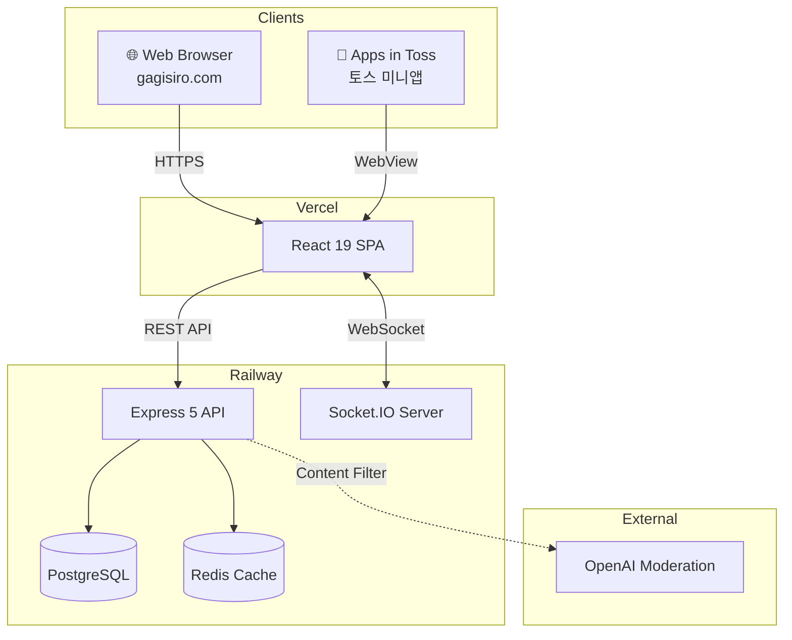

# Hi, I'm Eunseok Lee 👋

**프리랜서 풀스택 개발자** | AI 코딩 도구를 적극 활용하여 외주 프로젝트를 빠르고 정확하게 납품합니다.

[](mailto:korea5410@gmail.com)
[](https://biz-retriever.vercel.app)

---

<div align="center">

### 📈 By the Numbers

|  🧪 Tests  |   🚀 Projects    |         📱 Platforms         | 🎨 Demo Projects | ⚡ P95 Latency |
| :--------: | :--------------: | :--------------------------: | :--------------: | :------------: |
| **2,080+** | **9** production | **3** (Web · Toss · Android) |   **16** 데모    |   **~80ms**    |

</div>

---

## 🚀 Production Projects

### [Gagisiro (가기싫어)](https://github.com/doublesilver/subway-board) - 출근길 실시간 익명 채팅

> **12주 개발 → 1,556 tests · TypeScript 100% · 3개 플랫폼 배포**

**실제 운영 중인 서비스**: [gagisiro.com](https://gagisiro.com) (평일 07:00~09:00)

- 🚇 **Features**: 9개 호선별 실시간 채팅, 답장/리액션, 실시간 혼잡도, 게시글 검색, 푸시 알림
- 🤖 **AI Filtering**: Local Regex + OpenAI Moderation API 하이브리드 콘텐츠 필터링
- 📊 **Admin**: Recharts 대시보드, DAU/WAU/MAU 분석, 신고 관리, 커스텀 SQL 쿼리
- 🏗️ **Tech**: React 19 + Vite 6, Express 5, TypeScript 100%, PostgreSQL, Redis, Socket.IO
- 📱 **Apps in Toss**: 토스 미니앱 배포, 인앱 광고 3종 (배너/전면/보상형)
- 🔧 **Infra**: Railway (Backend + DB + Redis), Vercel (Frontend), GitHub Actions CI/CD
- ✅ **Quality**: 1,556 unit/integration tests + E2E 10 specs, 80%+ coverage, OWASP Top 10 대응

<details>
<summary><b>⚡ 성능 지표 (k6 부하 테스트)</b></summary>

| 시나리오   | 동시 사용자 |    처리량     | P95 응답 |
| ---------- | :---------: | :-----------: | :------: |
| Smoke      |      1      |  0.73 req/s   |   73ms   |
| Load       |     50      |  9.87 req/s   |   28ms   |
| **Stress** |   **200**   | **235 req/s** | **77ms** |
| **Spike**  |   **200**   | **363 req/s** | **81ms** |

> 200명 동시접속 안정 처리 · Redis 캐시 히트율 98.64% · API 평균 응답 16~35ms

</details>

<details>
<summary><b>🏗️ 시스템 아키텍처</b></summary>



</details>

---

### [Biz-Retriever](https://github.com/doublesilver/biz-retriever) - AI 기반 입찰 공고 분석 플랫폼

> **10일 개발 → 164 tests (100%) · Gemini AI 분석 · Raspberry Pi 배포**

- 🤖 **AI**: Google Gemini 2.5 Flash, LangChain RAG, Prompt Engineering
- 🏗️ **Tech**: FastAPI (Async/Await), PostgreSQL, Valkey, Taskiq, Docker
- 🔧 **DevOps**: Raspberry Pi + Tailscale, Prometheus + Grafana, HTTPS/SSL
- ✅ **Quality**: 164 tests (100%), 85% coverage, 9,572건 공고 수집 검증

**Live**: [biz-retriever.vercel.app](https://biz-retriever.vercel.app)

---

### [Maintenance App](https://github.com/doublesilver/maintenance-app) - AI 스마트 건물 유지보수 플랫폼

> **48시간 개발 → Groq Llama-3 AI 분류 · 비동기 작업 큐 · 풀스택 SaaS**

- 🤖 **AI**: Groq Llama-3 기반 민원 자동 분류/우선순위 산정 (OpenAI 대비 4.6배 빠름)
- 🏗️ **Tech**: Next.js 14 + Tailwind (Frontend), FastAPI + Celery + Redis (Backend)
- ⚡ **Performance**: Celery 비동기 처리로 응답 2.5s → 0.1s (25배 개선), 동시 처리량 98 req/s
- 🔐 **Security**: JWT 인증, RBAC, Rate Limiting
- 🔧 **Infra**: Railway (Backend), Vercel (Frontend), S3 이미지 업로드

**Live**: [maintenance-app-azure.vercel.app](https://maintenance-app-azure.vercel.app) · [API Docs](https://maintenance-app-production-9c47.up.railway.app/docs)

---

### [인터넷공룡](https://github.com/doublesilver/internet-dinor) - 인터넷/TV 가입 비교 사이트

> **Next.js 15 + React 19 + Supabase · 통신사 요금제 비교 서비스**

- 🏗️ **Tech**: Next.js 15, React 19, Supabase (DB + Auth), Tailwind CSS, Zod
- 📊 **Features**: 통신사별 요금제 비교, 가격 계산기, 상담 신청 폼
- 👨‍💼 **Admin**: 미들웨어 기반 관리자 페이지, 관리자 API
- 🔧 **Infra**: Vercel 배포, Firebase Studio/IDX 지원

**Live**: [internetdinor.vercel.app](https://internetdinor.vercel.app)

---

### [Scan](https://github.com/doublesilver/scan) - 물류창고 바코드 스캐너

> **64 tests · Android PDA(Zebra TC60) + FastAPI + SQLite + 웹 도면 에디터**

- 📱 **Mobile**: Kotlin Android 앱, Zebra TC60 PDA 바코드 스캔, MVVM + Retrofit2
- 🗺️ **Web Editor**: 웹 기반 창고 도면 에디터 (셀 크기·텍스트·테두리 설정, 영역 관리)
- 🏗️ **Backend**: FastAPI + aiosqlite, NAS WebDAV 연동, 도면 API 책임 분리
- 🔧 **Infra**: Zebra 전용 Mini PC 사내 서버, EAN-13 스캔→조회 0.3~0.5s
- ✅ **Quality**: 64 tests, 상품 데이터 보호, 프로덕션 하드웨어 무중단 운영

---

### [OddParty](https://github.com/doublesilver/oddparty-site) - 소셜 파티 신청 플랫폼

> **프레임워크 제로 풀스택 · 296 tests · 100% coverage**

- 🏗️ **Tech**: Vanilla HTML/CSS/JS (Frontend), Python stdlib http.server (Backend), SQLite/PostgreSQL
- 🔐 **Security**: JWT 인증, WYSIWYG 관리자 대시보드
- ✅ **Quality**: 296 tests, 100% 코드 커버리지
- 🔧 **Infra**: Vercel (Frontend) + Railway (Backend)

---

### [Knowledge Copilot](https://github.com/doublesilver/knowledge-copilot) - AI 문서 질의/요약 플랫폼

> **RAG 기반 문서 검색 · Next.js 14 + FastAPI**

- 🤖 **AI**: OpenAI Embedding + RAG 파이프라인, 문서 질의/요약
- 🏗️ **Tech**: Next.js 14 (Frontend), FastAPI + Python 3.12 (Backend), SQLite
- 🔧 **Infra**: Vercel + Railway, GitHub Actions CI/CD

---

### [S Partners Landing](https://github.com/doublesilver/s-partners-landing) - 소상공인 정책자금 상담 랜딩

> **모바일 우선 반응형 · FormSubmit 연동**

- 🏗️ **Tech**: HTML5, CSS3, Vanilla JS
- 📱 **UX**: 모바일 우선 반응형, 신뢰감 중심 UI
- 🔧 **Infra**: Vercel 배포, FormSubmit 이메일 연동

---

## 🎨 Demo Portfolio — 16개 업종별 데모 프로젝트

외주 상담 시 클라이언트에게 바로 보여줄 수 있는 **업종별 맞춤 데모** 모음입니다.

| 카테고리        | 프로젝트                                                             | 설명                            |                           Live                           |
| --------------- | -------------------------------------------------------------------- | ------------------------------- | :------------------------------------------------------: |
| **예약/매장**   | [demo-booking](https://github.com/doublesilver/demo-booking)         | 예약 관리 시스템                |   [Demo](https://doublesilver.github.io/demo-booking/)   |
|                 | [demo-cafe](https://github.com/doublesilver/demo-cafe)               | 카페 소개 사이트                |    [Demo](https://doublesilver.github.io/demo-cafe/)     |
|                 | [demo-clinic](https://github.com/doublesilver/demo-clinic)           | 건강관리/의료 예약 플랫폼       |   [Demo](https://doublesilver.github.io/demo-clinic/)    |
|                 | [demo-studio](https://github.com/doublesilver/demo-studio)           | 1인 스튜디오 포트폴리오·예약    |   [Demo](https://doublesilver.github.io/demo-studio/)    |
|                 | [demo-queue](https://github.com/doublesilver/demo-queue)             | 매장 대기열 관리 시스템         |    [Demo](https://doublesilver.github.io/demo-queue/)    |
| **커머스/유통** | [demo-catalog](https://github.com/doublesilver/demo-catalog)         | 상품 카탈로그 쇼핑 인터페이스   |   [Demo](https://doublesilver.github.io/demo-catalog/)   |
|                 | [demo-inventory](https://github.com/doublesilver/demo-inventory)     | 재고 관리 대시보드              |  [Demo](https://doublesilver.github.io/demo-inventory/)  |
|                 | [demo-order](https://github.com/doublesilver/demo-order)             | 도매·유통 주문접수+배송 관리    |    [Demo](https://doublesilver.github.io/demo-order/)    |
| **업무자동화**  | [demo-crm-lite](https://github.com/doublesilver/demo-crm-lite)       | 소상공인용 고객 메모·재방문 CRM |  [Demo](https://doublesilver.github.io/demo-crm-lite/)   |
|                 | [demo-hr](https://github.com/doublesilver/demo-hr)                   | 출퇴근·급여·연차 관리 시스템    |     [Demo](https://doublesilver.github.io/demo-hr/)      |
|                 | [demo-report-gen](https://github.com/doublesilver/demo-report-gen)   | 주간/월간 리포트 자동 생성      | [Demo](https://doublesilver.github.io/demo-report-gen/)  |
|                 | [demo-receipt](https://github.com/doublesilver/demo-receipt)         | 영수증 OCR → 자동 경비 정리     |   [Demo](https://doublesilver.github.io/demo-receipt/)   |
| **AI/데이터**   | [demo-chatbot](https://github.com/doublesilver/demo-chatbot)         | AI 고객 상담 자동화             |   [Demo](https://doublesilver.github.io/demo-chatbot/)   |
|                 | [demo-review-ai](https://github.com/doublesilver/demo-review-ai)     | 리뷰 AI 감성분석 대시보드       |  [Demo](https://doublesilver.github.io/demo-review-ai/)  |
|                 | [demo-news-digest](https://github.com/doublesilver/demo-news-digest) | 뉴스 자동 수집·요약·슬랙 발송   | [Demo](https://doublesilver.github.io/demo-news-digest/) |
| **전문직**      | [demo-lawfirm](https://github.com/doublesilver/demo-lawfirm)         | 법률 사무소 상담 신청 사이트    |   [Demo](https://doublesilver.github.io/demo-lawfirm/)   |

---

## 🛠️ Tech Stack

**Languages & Frameworks**


**AI & ML**


**Database & Infrastructure**


---

## ⚙️ How I Build — AI-Assisted Engineering Workflow

```
1. PLAN    ─── AI Agent가 코드베이스 탐색 → 구현 전략 제안 → Human 검토/승인
2. CODE    ─── Context-Aware 코드 생성 (MCP: LSP + AST-grep 기반 리팩토링)
3. TEST    ─── AI 생성 코드 → 즉시 테스트 작성 → 2,080+ tests 자동 검증
4. REVIEW  ─── Human이 보안/성능/아키텍처 최종 판단 → 머지
5. DEPLOY  ─── CI/CD 파이프라인 자동 검증 → 멀티 플랫폼 배포
```

---

## 📊 GitHub Stats

<div align="center">


</div>

---

## 🐍 Contribution Graph

<div align="center">

<picture>
  <source media="(prefers-color-scheme: dark)" srcset="https://raw.githubusercontent.com/doublesilver/doublesilver/output/github-contribution-grid-snake-dark.svg" />
  <source media="(prefers-color-scheme: light)" srcset="https://raw.githubusercontent.com/doublesilver/doublesilver/output/github-contribution-grid-snake.svg" />
  
</picture>

</div>

---

<!-- Last Updated 자동 갱신: 2026-04-10 -->

**Current Focus**: 외주 프로젝트 납품 + 업종별 데모 포트폴리오 확장
**Open to**: Full-Stack / Backend / AI Engineer 외주 및 포지션

📬 **외주 문의**: [korea5410@gmail.com](mailto:korea5410@gmail.com)
