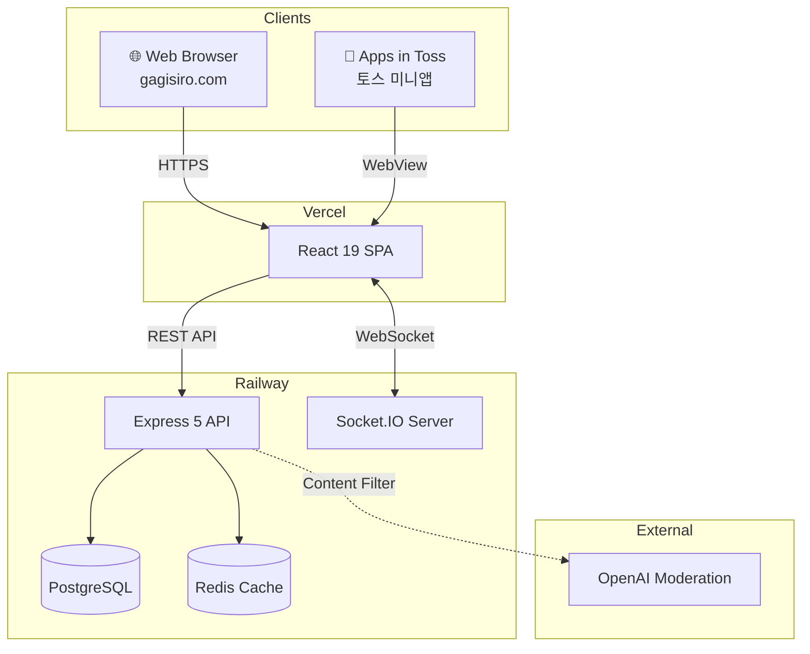

### Hi, I'm Eunseok Lee 👋

AI 코딩 도구를 적극 활용하여 **프로덕션 레벨 프로젝트**를 구축하는 개발자입니다.

[](mailto:korea5410@gmail.com)
[](https://biz-retriever.vercel.app)

---

<div align="center">

### 📈 By the Numbers

| 🧪 Tests | 🌐 Live Services | 📱 Platforms | ⚡ P95 Latency | 🛡️ Cache Hit Rate |
|:---------:|:----------------:|:------------:|:--------------:|:-----------------:|
| **1,720+** | **2** production | **3** (Web · Toss · Pi) | **< 80ms** | **98.6%** |

</div>

---

## 🚀 Live Projects

### [Gagisiro (가기싫어)](https://github.com/doublesilver/subway-board) - 출근길 실시간 익명 채팅

> **12주 개발 → 1,556 tests · TypeScript 100% · 3개 플랫폼 배포**

**실제 운영 중인 서비스**: [gagisiro.com](https://gagisiro.com) (평일 07:00~09:00)

- 🚇 **Features**: 9개 호선별 실시간 채팅, 답장/리액션, 실시간 혼잡도, 게시글 검색, 푸시 알림
- 🤖 **AI Filtering**: Local Regex + OpenAI Moderation API 하이브리드 콘텐츠 필터링
- 📊 **Admin**: Recharts 대시보드, DAU/WAU/MAU 분석, 신고 관리, 커스텀 SQL 쿼리
- 🏗️ **Tech**: React 19 + Vite 6, Express 5, TypeScript 100%, PostgreSQL, Redis, Socket.IO
- 📱 **Apps in Toss**: 토스 미니앱 배포 지원, 인앱 광고 3종 (배너/전면/보상형), WebView UX 적응
- 🔧 **Infra**: Railway (Backend + DB + Redis), Vercel (Frontend), GitHub Actions CI/CD
- ✅ **Quality**: 1,556 unit/integration tests + E2E 10 specs, 80%+ coverage, OWASP Top 10 대응

<details>
<summary><b>⚡ 성능 지표 (k6 부하 테스트)</b></summary>

| 시나리오 | 동시 사용자 | 처리량 | P95 응답 |
|---------|:---------:|:------:|:-------:|
| Smoke | 1 | 0.73 req/s | 73ms |
| Load | 50 | 9.87 req/s | 28ms |
| **Stress** | **200** | **235 req/s** | **77ms** |
| **Spike** | **200** | **363 req/s** | **81ms** |

> 200명 동시접속 안정 처리 · Redis 캐시 히트율 98.64% · API 평균 응답 16~35ms

</details>

<details>
<summary><b>🏗️ 시스템 아키텍처</b></summary>



> 단일 코드베이스에서 `isAppsInToss()` 분기로 Web/Toss 동시 지원, 기존 웹 영향 제로

</details>

---

### [Biz-Retriever](https://github.com/doublesilver/biz-retriever) - AI 기반 입찰 공고 분석 플랫폼

> **10일 개발 → 164 tests (100%) · Gemini AI 분석 · Raspberry Pi 배포**

**⚡ Built with AI-Powered Development**:
`Gemini Pro` + `Antigravity` + `Agent Orchestration`으로 **10일 만에 프로덕션 배포** 완료

- 🤖 **AI Skills**: Google Gemini 2.5 Flash, LangChain RAG, Prompt Engineering
- 🏗️ **Tech**: FastAPI (Async/Await), PostgreSQL, Valkey, Taskiq, Docker
- 🎨 **Frontend**: Vanilla JS (Payhera/Naver Design System)
- 🔧 **DevOps**: Raspberry Pi + Tailscale, Prometheus + Grafana, HTTPS/SSL
- ✅ **Quality**: 164 tests (100%), 85% coverage, 9,572건 공고 수집 검증

**Live**:
- Frontend: https://biz-retriever.vercel.app
- Backend: https://leeeunseok.tail32c3e2.ts.net

---

## ⚙️ How I Build — AI-Assisted Engineering Workflow

단순히 "AI로 코드를 짜는 것"이 아니라, **엔지니어링 프로세스에 AI를 통합**합니다.

```
1. PLAN    ─── AI Agent가 코드베이스 탐색 → 구현 전략 제안 → Human 검토/승인
2. CODE    ─── Context-Aware 코드 생성 (MCP: LSP + AST-grep 기반 정확한 리팩토링)
3. TEST    ─── AI 생성 코드 → 즉시 테스트 작성 → 1,720+ tests 자동 검증
4. REVIEW  ─── Human이 보안/성능/아키텍처 최종 판단 → 머지
5. DEPLOY  ─── CI/CD 파이프라인 자동 검증 → 멀티 플랫폼 배포
```

| 지표 | Gagisiro (12주) | Biz-Retriever (10일) |
|------|:--------------:|:-------------------:|
| 테스트 | 1,556 tests | 164 tests (100%) |
| 커버리지 | 80%+ | 85% |
| TypeScript/Python | 100% strict | 100% typed |
| 프로덕션 배포 | Web + Toss 미니앱 | Web + Raspberry Pi |

---

## 🛠️ Tech Stack & AI Tools

**Languages & Frameworks**


**AI & ML**


**Database & Infrastructure**


---

## 💡 Why My Projects Stand Out

### 1. **Production-First Mindset**
"작동하는 것"이 아닌 **"운영 가능한 것"** 중심 개발:
- **보안**: OWASP Top 10, Helmet CSP, HMAC-SHA256 인증, Rate Limiting
- **관측성**: Prometheus + Grafana 모니터링, 구조화 로깅 (Winston)
- **가용성**: Redis Fail-Safe (장애 시 DB 자동 fallback), Health Check 엔드포인트
- **백업**: pg_dump + cron 자동 백업, DDoS 방어 (fail2ban)

### 2. **Multi-Platform, Single Codebase**
하나의 코드베이스에서 **3개 플랫폼** 동시 배포:
- **Web**: Vercel (SPA) + Railway (API) — gagisiro.com
- **Apps in Toss**: 토스 미니앱 (.ait), `isAppsInToss()` 조건부 분기로 기존 웹 영향 제로
- **Self-Hosting**: Raspberry Pi + Tailscale Funnel — biz-retriever

### 3. **Measurable Quality**
감이 아닌 **수치**로 증명:
- 1,720+ 테스트, 80%+ 커버리지 across all projects
- k6 부하 테스트: 200명 동시접속, P95 < 80ms
- Redis 캐시 히트율 98.6%, API 평균 응답 16~35ms

---

## 📊 GitHub Stats

<div align="center">


</div>

---

## 🐍 Contribution Graph

<div align="center">

<picture>
  <source media="(prefers-color-scheme: dark)" srcset="https://raw.githubusercontent.com/doublesilver/doublesilver/output/github-contribution-grid-snake-dark.svg" />
  <source media="(prefers-color-scheme: light)" srcset="https://raw.githubusercontent.com/doublesilver/doublesilver/output/github-contribution-grid-snake.svg" />
  
</picture>

</div>

---

**Last Updated**: 2026-02-24
**Current Focus**: AI 코딩 워크플로우 최적화 및 멀티 플랫폼 배포 경험 확장
**Open to**: Full-Stack / Backend / AI Engineer 포지션
